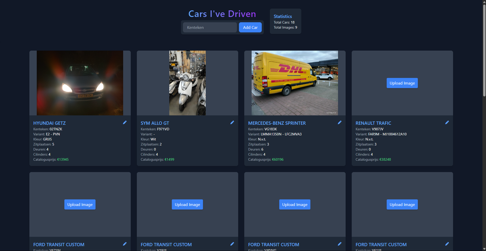
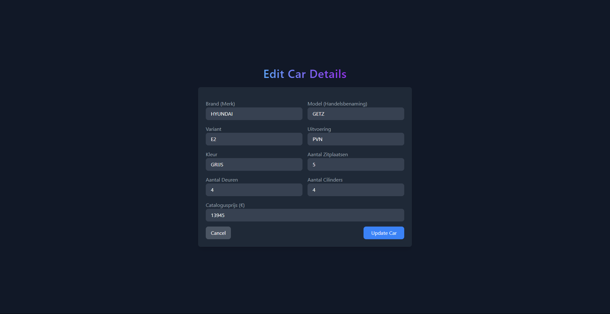

# Car Collection App

This project is a web application for managing and displaying a collection of cars you have driven. It provides a compact overview of all cars with their stats and a personal stats view to share.

## Features

- View all cars in a compact overview with their stats.
- View personal stats such as total cars, average year, and most common brand.
- Add new cars to the collection.
- Edit car details.
- Upload and delete car images.

## Technologies Used

- Go
- Echo framework
- Jet templates
- Tailwind CSS

## Installation

1. Clone the repository:
    ```sh
    git clone https://github.com/yourusername/car-collection-app.git
    cd car-collection-app
    ```

2. Install dependencies:
    ```sh
    go mod tidy
    ```

3. Create a `.env` file with the necessary environment variables.

4. Run the application:
    ```sh
    go run main.go
    ```

5. Open your browser and navigate to `http://localhost:8080`.

## Project Structure

- `main.go`: The main entry point of the application.
- `handlers/`: Contains the request handlers.
- `database/`: Contains database-related functions.
- `views/`: Contains Jet templates for rendering HTML views.
- `static/`: Contains static files like CSS and JavaScript.

## Usage

### Viewing Cars

Navigate to the home page to see a list of all cars in a compact overview.

### Adding a Car

Use the form on the home page to add a new car by entering the `kenteken` and submitting the form.

### Editing a Car

Click on a car in the overview to edit its details. Update the fields and submit the form to save changes.

## Images

